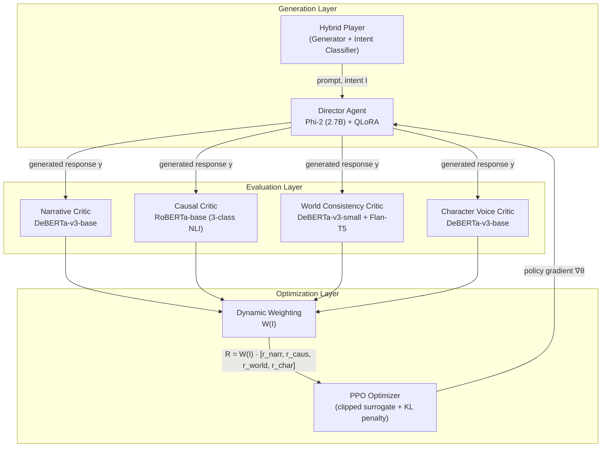
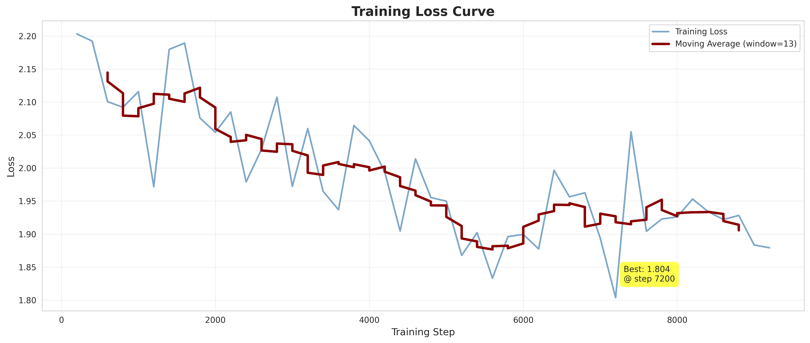
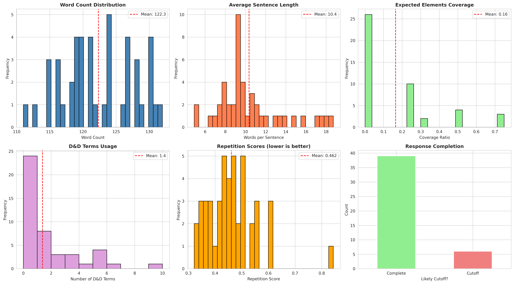

<div align="center">

# 🎲 The Director LLM
### A Multi-Critic Reinforcement Learning Framework for Domain-Aware Narrative Generation

**Dropout Squad** · International Institute of Information Technology, Hyderabad

[](https://www.python.org/)
[](https://pytorch.org/)
[](https://huggingface.co/)
[](./LICENSE)
[](.)

[**📄 Read the Paper**](./Dropout_Squad.pdf) &nbsp;·&nbsp; [Results](#-results) &nbsp;·&nbsp; [Architecture](#-architecture) &nbsp;·&nbsp; [Quick Start](#-quick-start) &nbsp;·&nbsp; [Module Docs](#-repository-structure) &nbsp;·&nbsp; [Citation](#-citation)

</div>

---

## Overview

Supervised fine-tuning teaches a language model to imitate one style under one implicit objective. Interactive narrative generation needs more than that. A Dungeon Master has to be vivid and precise, atmospheric and logically consistent, improvisational and faithful to events already established in the story. These objectives pull in different directions, and a model optimized for one tends to fail quietly at the others.

**The Director LLM** solves this with Multi-Critic Reinforcement Learning (MCRL). It splits "good DM response" into four specialized, independently trained, independently measurable competencies: narrative quality, causal consistency, world coherence, and character voice. It then learns when each one should dominate through intent-conditioned dynamic reward weighting. A response to *"I cast Fireball at the goblins"* should be judged mostly on causal precision. A response to *"I ask the bartender about the rumors"* should be judged mostly on character voice. A single reward model cannot represent that distinction. Four critics and a learned weighting function can.

The system trains end to end with PPO on over 310,000 examples combining professional D&D transcripts ([CRD3](https://github.com/RevanthRameshkumar/CRD3)) and crowdsourced fantasy dialogue ([LIGHT](https://github.com/facebookresearch/ParlAI)). It takes a supervised baseline to a context-aware policy that improves on every quality dimension at once, with no trade-off between them.

---

## 📈 Results

Supervised fine-tuning alone was not enough. 57% of SFT baseline outputs fell below the narrative quality threshold, and mean causal consistency sat at just 0.189 despite 310K training examples. Multi-critic PPO training closed that gap substantially.

<div align="center">

| Metric | SFT Baseline | MCRL (PPO) | Improvement |
|---|:---:|:---:|:---:|
| **Mean Reward** | 0.412 | 0.611 | **+48.3%** |
| Narrative Quality | 0.523 | 0.694 | +32.7% |
| **Causal Consistency** | 0.189 | 0.567 | **+200.0%** |
| World Consistency | 0.618 | 0.821 | +32.8% |
| **Character Voice** | 0.138 | 0.268 | **+94.2%** |

</div>

Every dimension improved at once. Multi-objective optimization sidestepped the zero-sum trade-offs a single reward model would have forced. The core hypothesis held up empirically too: **dynamic, intent-conditioned weighting beat uniform static weighting by +15.7%** on mean reward. Exploration prompts saw the largest narrative gains, combat prompts the largest causal gains, and dialogue prompts the largest character-voice gains. Each critic matters most precisely where it should.

<details>
<summary><b>Before and after examples</b></summary>
<br>

**Causal consistency (Action context).** Player: *"I cast Fireball at the goblin horde."*
- SFT baseline ignored the action, describing generic tavern chaos (causal score: 0.09)
- PPO-trained model: *"Your Fireball streaks toward the horde... two goblins are incinerated instantly..."* (causal score: 0.94)

**Narrative richness (Explore context).** Player examines an ancient door.
- SFT baseline: *"It is made of stone."* (narrative score: 0.27)
- PPO-trained model: *"...a masterwork of ancient dwarven craftsmanship... intricate runes glowing faintly..."* (narrative score: 0.91)

**Character voice (Dialogue context).** Player asks the innkeeper about a stranger.
- SFT baseline: generic, no personality (character score: 0.08)
- PPO-trained model: distinct dialect and voice, *"'Aye, that one,' she whispers in a thick northern accent..."* (character score: 0.81)

</details>

---

## 🏗 Architecture

The system runs in three layers: a **Generation Layer** that produces a response conditioned on a classified player intent, an **Evaluation Layer** of four specialized critics scoring every response in parallel, and an **Optimization Layer** that turns those four scores into a single intent-weighted reward for PPO.



**The central design choice is that critic weights are not fixed.** They shift based on what the player is trying to do:

```python
intent_weights = {
    "EXPLORE":  {"narrative": 0.40, "causal": 0.20, "world": 0.30, "character": 0.10},
    "ACTION":   {"narrative": 0.20, "causal": 0.40, "world": 0.30, "character": 0.10},
    "DIALOGUE": {"narrative": 0.20, "causal": 0.20, "world": 0.20, "character": 0.40},
}
```

This is what lets a single policy give an atmospheric, loosely constrained answer to "I search the ruins" and a mechanically precise, tightly constrained answer to "I attack with my sword," without training separate models for each context.

### Core components

| Component | Model | Size | Validated Performance | Training Data |
|---|---|:---:|---|:---:|
| **Director Agent** (policy) | Phi-2 + QLoRA | 2.7B (7.8M trainable, 0.28%) | n/a | 310K (CRD3 + LIGHT) |
| **Narrative Critic** | DeBERTa-v3-base (regression) | 184M | Pearson r = 0.938 | 40,906 |
| **Causal Critic** | RoBERTa-base (3-class NLI) | 125M | 88.09% acc, macro F1 88.15% | 382,530 |
| **World Consistency Critic** | DeBERTa-v3-small classifier + Flan-T5-large extractor | 86M + 780M | 98.39% acc across 4 violation classes | 38,436 |
| **Character Voice Critic** | DeBERTa-v3-base + learned NPC embeddings | 184M | 87.6% acc (P 88.2 / R 86.4 / F1 87.3) | 15,642 |
| **Hybrid Player** (generator) | DistilGPT-2 | 82M | n/a | 519,597 player utterances |
| **Hybrid Player** (classifier) | DistilBERT-base (3-way intent) | 66M | Confidence: Explore 0.87, Action 0.91, Dialogue 0.84 | CRD3 + LIGHT |

*Full per-class metrics, configs, and architecture notes for each component live in that module's own README. See [Repository Structure](#-repository-structure) below.*

---

## 🚀 Quick Start

### Prerequisites
- Python 3.8+
- CUDA-capable GPU, 16GB+ VRAM recommended (developed on an RTX 4080 Super)
- PyTorch 2.0+

### Installation

```bash
git clone https://github.com/Ekansh0301/Dropout-Squad.git
cd Dropout-Squad
pip install -r requirements.txt
```

### Inference

```python
from transformers import AutoModelForCausalLM, AutoTokenizer
from peft import PeftModel

base = AutoModelForCausalLM.from_pretrained("microsoft/phi-2")
tokenizer = AutoTokenizer.from_pretrained("microsoft/phi-2")
model = PeftModel.from_pretrained(base, "path/to/ppo-trained-adapter")

prompt = "Player: I examine the ancient door.\nDungeon Master:"
inputs = tokenizer(prompt, return_tensors="pt")
output = model.generate(**inputs, max_new_tokens=200)
print(tokenizer.decode(output[0], skip_special_tokens=True))
```

### Training pipeline

```bash
# 1. Supervised baseline (Phi-2 + QLoRA)
cd DM-SFT/
python train_sft_phi2.py --config sft_config.yaml

# 2. Train the critics (skip if using the provided checkpoints)
cd "../causal critic/"      && python train_3class.py
cd "../narrative critic/"   && python narrative_critic.py
cd "../hybrid_player/"      && python train_hybrid_player.py
# World Consistency and Character Voice critics: see their respective notebooks

# 3. Multi-Critic RL (PPO), the main event
cd ../PPO/
python train_complete_ppo.py --config ppo_config.yaml
```

Each command above is a starting point. Exact flags, config overrides, and troubleshooting notes live in each module's own README.

---

## 📁 Repository Structure

```
Dropout-Squad/
├── DM-SFT/                       # Director Agent supervised baseline (Phi-2 + QLoRA)
├── PPO/                          # Multi-critic PPO training, the core contribution
├── causal critic/                 # Causal Responsiveness Critic (RoBERTa, 3-class NLI)
├── narrative critic/               # Narrative Quality Critic (DeBERTa, regression)
├── world_consistency critic/       # World Consistency Critic (hybrid neural-symbolic)
├── character-voice critic/         # Character Voice Critic (NPC embeddings)
├── hybrid_player/                  # Player simulation: generator + intent classifier
├── Evaluation/                     # End-to-end evaluation pipeline
├── Data/                           # Dataset documentation and preprocessing
├── requirements.txt
├── LICENSE
└── Dropout_Squad.pdf               # Full project paper
```

Every module has its own README with full implementation detail, training configs, and exact commands. The summaries below are intentionally brief; follow the links for the rest.

| Module | Summary | Docs |
|---|---|:---:|
| `DM-SFT/` | Phi-2 + QLoRA supervised baseline that seeds the policy before reinforcement learning. | [README](./DM-SFT/README.md) |
| `PPO/` | The multi-critic PPO training loop, dynamic weighting, and reward aggregation. | [README](./PPO/README.md) |
| `causal critic/` | RoBERTa-based NLI model scoring causal consistency between player actions and DM responses. | [README](./causal%20critic/README.md) |
| `narrative critic/` | DeBERTa regression model scoring descriptive quality, atmosphere, and coherence. | [README](./narrative%20critic/README.md) |
| `world_consistency critic/` | Hybrid neural-symbolic critic that tracks world state and flags contradictions, hallucinations, and amnesia. | [README](./world_consistency%20critic/README.md) |
| `character-voice critic/` | DeBERTa model with learned per-NPC embeddings for character voice consistency. | [README](./character-voice%20critic/README.md) |
| `hybrid_player/` | Generates synthetic player prompts and classifies their intent for dynamic weighting. | [README](./hybrid_player/README.md) |
| `Evaluation/` | End-to-end evaluation pipeline, statistical analysis, and qualitative reporting. | [README](./Evaluation/README.md) |
| `Data/` | Dataset sourcing, schemas, file-naming conventions, and preprocessing steps. | [README](./Data/README.md) |

---

## 📊 Datasets

| Source | Role | Examples |
|---|---|:---:|
| [**CRD3**](https://github.com/RevanthRameshkumar/CRD3) (Critical Role D&D Dataset) | Primary DM training data from 159 episodes of professional, unscripted D&D play | 200,950 DM utterances · 410,797 player utterances |
| [**LIGHT**](https://github.com/facebookresearch/ParlAI) (Learning in Interactive Games with Humans and Text) | Fantasy dialogue patterns and explicit action labels for intent classification | 108,800 responses across 11,000 episodes |
| **ROCStories / TinyStories** | General narrative coherence signal for the Narrative Critic | 30,000 + 10,906 D&D responses, 40,906 with synthetic negatives |

**Combined SFT corpus:** 309,750 examples (Train 263,287 / Val 30,975 / Test 15,488). Full preprocessing details, schemas, and storage requirements are in [`Data/README.md`](./Data/README.md).

🔗 [Dataset download](https://1drv.ms/f/c/bdcf3b74ef9b6129/Ep8Im9Kl-SNOspd2NAYqJ4MBzBsoeKe3uRlr6IhZiDkyGg?e=hrZgDd) · 🔗 [Pretrained model checkpoints](https://iiithydresearch-my.sharepoint.com/my?id=%2Fpersonal%2Faman%5Fsrivastava%5Fresearch%5Fiiit%5Fac%5Fin%2FDocuments%2FANLPProjectModels&viewid=645125c6%2Dfd29%2D494e%2D9af6%2Ddc9d91243e02&source=waffle)

---

## 🔬 Detailed Evaluation

<details>
<summary><b>Intent-stratified performance: does the weighting actually target the right objective</b></summary>
<br>

**EXPLORE (narrative-heavy weighting)**

| | Combined | Narrative | Causal | World | Character |
|---|:---:|:---:|:---:|:---:|:---:|
| SFT | 0.451 | 0.564 | 0.172 | 0.661 | 0.126 |
| PPO | 0.638 | 0.721 | 0.489 | 0.836 | 0.192 |
| Δ | +0.187 | **+0.157** | +0.317 | +0.175 | +0.066 |

**ACTION (causal-heavy weighting)**

| | Combined | Narrative | Causal | World | Character |
|---|:---:|:---:|:---:|:---:|:---:|
| SFT | 0.378 | 0.489 | 0.198 | 0.581 | 0.134 |
| PPO | 0.607 | 0.671 | 0.641 | 0.812 | 0.217 |
| Δ | +0.229 | +0.182 | **+0.443** | +0.231 | +0.083 |

**DIALOGUE (character-heavy weighting)**

| | Combined | Narrative | Causal | World | Character |
|---|:---:|:---:|:---:|:---:|:---:|
| SFT | 0.407 | 0.518 | 0.204 | 0.629 | 0.157 |
| PPO | 0.589 | 0.689 | 0.519 | 0.784 | 0.341 |
| Δ | +0.182 | +0.171 | +0.315 | +0.155 | **+0.184** |

Each context's single largest gain lands exactly where its weighting vector says it should. That is direct evidence the dynamic weighting does what it claims to do.

</details>

<details>
<summary><b>PPO training progression (1,000 steps, about 53 minutes on an RTX 4080 Super 16GB)</b></summary>
<br>

| Step | Mean | Narrative | Causal | World | Character |
|---:|:---:|:---:|:---:|:---:|:---:|
| 0 | 0.412 | 0.523 | 0.189 | 0.618 | 0.138 |
| 250 | 0.507 | 0.601 | 0.374 | 0.721 | 0.189 |
| 500 | 0.571 | 0.658 | 0.487 | 0.782 | 0.233 |
| 750 | 0.598 | 0.681 | 0.541 | 0.807 | 0.256 |
| 1000 | 0.611 | 0.694 | 0.567 | 0.821 | 0.268 |

Training shows three clear phases: strong initial learning from step 0 to 250, sustained improvement from 250 to 750, and convergence from 750 to 1000. No reward hacking or mode collapse was observed across the run.

</details>

<details>
<summary><b>Narrative critic calibration</b></summary>
<br>

| Validation Metric | Value |
|---|:---:|
| Loss | 0.0158 |
| MAE | 0.3215 |
| RMSE | 0.3341 |
| **Pearson Correlation** | **0.938** |
| R² | 0.121 |

Strong relative ranking (Pearson 0.94) despite weaker absolute calibration (R² 0.12), a known limitation discussed below that stems from the domain gap between ROCStories pretraining and D&D evaluation. Ranking quality is what matters for RL reward shaping, and that holds up.

</details>

### Visual results

<table>
<tr>
<td></td>
<td></td>
</tr>
<tr>
<td align="center">SFT training loss</td>
<td align="center">Quality metrics across evaluation dimensions</td>
</tr>
</table>

---

## 💡 Key Findings

1. **Supervised fine-tuning plateaus regardless of scale.** 310K training examples still produced generic vocabulary, formulaic phrasing, and 57% of outputs below the narrative quality threshold. The ceiling is architectural, not data-limited.
2. **Decomposed, specialized critics outperform a single monolithic reward signal.** Each critic targets a distinct failure mode: lexical diversity, logical consistency, world state, and dialogue pragmatics. Improving one does not come at the expense of another.
3. **Context-dependent weighting is a functional requirement, not a tuning detail.** It lets one policy serve fundamentally different quality profiles, atmospheric exploration versus mechanically precise combat, without training separate models, and it outperforms static weighting by 15.7%.
4. **Hybrid neural-symbolic critics outperform pure neural or pure symbolic approaches for stateful tracking.** The World Consistency Critic pairs an explicit state tracker with a neural extractor and reaches 98.4% accuracy across four distinct violation types.
5. **The first model is rarely the right one.** The causal critic shipped as a 2-class DeBERTa-v2 model before the team found it did not generalize, then was replaced with the 3-class RoBERTa-base formulation that reaches 88% accuracy in production today.

### Limitations and future work

- **Critic calibration.** The narrative critic ranks well (Pearson 0.94) but absolute score calibration is weaker (R² 0.12). Domain-adaptive calibration is open work.
- **Intent classification dependency.** Dynamic weighting inherits roughly 87 to 91 percent classifier confidence, and a misclassified intent applies the wrong weight vector. Confidence-weighted interpolation between static and dynamic weights is a natural next step.
- **Temporal credit assignment.** Critics currently score each turn independently. Trajectory-level critics for long-horizon narrative coherence are future work.
- **Human evaluation.** All critics are currently self-supervised and automated. A human preference loop would validate, and likely improve, critic targets.

---

## 📄 Citation

If you build on this work, please cite it:

```bibtex
@techreport{dropoutsquad2025director,
  title        = {The Director LLM: A Multi-Critic Reinforcement Learning Framework
                   for Domain-Aware Narrative Generation},
  author       = {Goyal, Ekansh and Srivastava, Aman and Gupta, Jayant},
  institution  = {International Institute of Information Technology, Hyderabad},
  year         = {2025},
  note         = {\url{https://github.com/Ekansh0301/Dropout-Squad}}
}
```

---

## 👥 Team

**Dropout Squad**, International Institute of Information Technology, Hyderabad

| Name | Email |
|---|---|
| Ekansh Goyal | ekansh.goyal@research.iiit.ac.in |
| Aman Srivastava | aman.srivastava@research.iiit.ac.in |
| Jayant Gupta | jayant.gupta@research.iiit.ac.in |

## 🙏 Acknowledgments

Built on [CRD3](https://github.com/RevanthRameshkumar/CRD3) (Rameshkumar & Bailey, 2020), [LIGHT](https://github.com/facebookresearch/ParlAI) (Urbanek et al., 2019), and [ROCStories](https://cs.rochester.edu/nlp/rocstories/) / TinyStories. Trained with 🤗 Transformers, PEFT, and TRL. Policy optimization via PPO (Schulman et al., 2017). Base model adaptation via QLoRA (Dettmers et al., 2023).

## License

Released under the [MIT License](./LICENSE). See `LICENSE` for the full text.

---

<div align="center">
<sub>Full methodology, related work, and complete results in <a href="./Dropout_Squad.pdf">Dropout_Squad.pdf</a></sub>
</div>